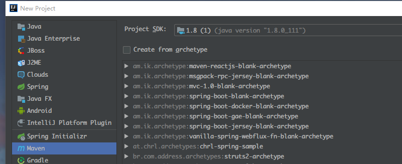
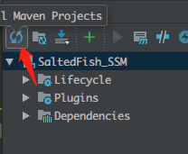
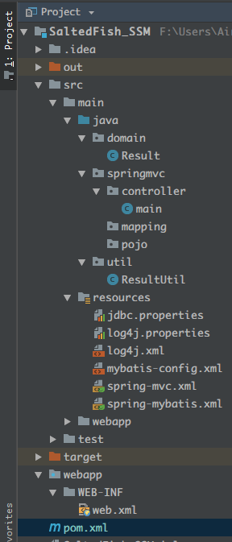
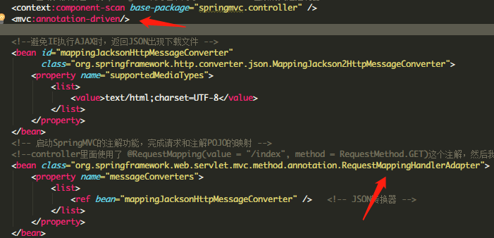
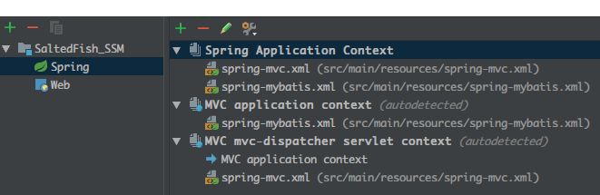
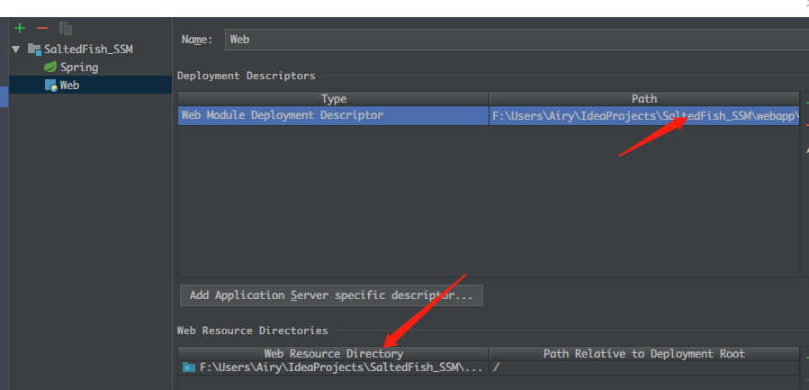
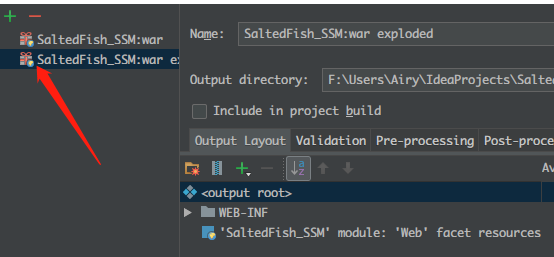

# 前言
虽然写过Springboot，但是外面的环境基本上都是ssm为主（ssh就算了。。。）,所以开始了ssm的掉坑之旅（真tm坑）

# 环境
* Windows 10
* Intelij idea
* jdk8

## 创建项目
首先是新建一个空的Maven项目，右边的模板什么都不要选


然后就是一路的Next，填上Group_ID什么的

## 配置Maven下载依赖
在pom.xml填入以下代码，版本自行选择
```
<?xml version="1.0" encoding="UTF-8"?>
<project xmlns="http://maven.apache.org/POM/4.0.0"
         xmlns:xsi="http://www.w3.org/2001/XMLSchema-instance"
         xsi:schemaLocation="http://maven.apache.org/POM/4.0.0 http://maven.apache.org/xsd/maven-4.0.0.xsd">
    <modelVersion>4.0.0</modelVersion>

    <groupId>你自己的</groupId>
    <artifactId>同上</artifactId>
    <version>1.0-SNAPSHOT</version>

    <properties>
        <project.build.sourceEncoding>UTF-8</project.build.sourceEncoding>
        <!-- spring版本号 -->
        <spring.version>4.1.4.RELEASE</spring.version>
        <!-- mybatis版本号 -->
        <mybatis.version>3.2.8</mybatis.version>
        <!-- log4j日志文件管理包版本 -->
        <slf4j.version>1.7.7</slf4j.version>
        <log4j.version>1.2.17</log4j.version>
        <!-- jackson包版本 -->
        <jackson.version>2.5.0</jackson.version>
    </properties>

    <dependencies>

        <dependency>
            <groupId>junit</groupId>
            <artifactId>junit</artifactId>
            <version>3.8.1</version>
            <scope>test</scope>
        </dependency>
        <!-- mybatis核心包 -->
        <dependency>
            <groupId>org.mybatis</groupId>
            <artifactId>mybatis</artifactId>
            <version>${mybatis.version}</version>
        </dependency>
        <!-- mybatis/spring包 -->
        <dependency>
            <groupId>org.mybatis</groupId>
            <artifactId>mybatis-spring</artifactId>
            <version>1.2.2</version>
        </dependency>

        <!--spring单元测试依赖 -->
        <dependency>
            <groupId>org.springframework</groupId>
            <artifactId>spring-test</artifactId>
            <version>${spring.version}</version>
            <scope>test</scope>
        </dependency>

        <!-- springMVC核心包 -->
        <dependency>
            <groupId>org.springframework</groupId>
            <artifactId>spring-webmvc</artifactId>
            <version>${spring.version}</version>
        </dependency>

        <!-- spring核心包 -->
        <dependency>
            <groupId>org.springframework</groupId>
            <artifactId>spring-core</artifactId>
            <version>${spring.version}</version>
        </dependency>

        <dependency>
            <groupId>org.springframework</groupId>
            <artifactId>spring-beans</artifactId>
            <version>${spring.version}</version>
        </dependency>

        <dependency>
            <groupId>org.springframework</groupId>
            <artifactId>spring-context</artifactId>
            <version>${spring.version}</version>
        </dependency>

        <dependency>
            <groupId>org.springframework</groupId>
            <artifactId>spring-context-support</artifactId>
            <version>${spring.version}</version>
        </dependency>

        <dependency>
            <groupId>org.springframework</groupId>
            <artifactId>spring-tx</artifactId>
            <version>${spring.version}</version>
        </dependency>

        <dependency>
            <groupId>org.springframework</groupId>
            <artifactId>spring-web</artifactId>
            <version>${spring.version}</version>
        </dependency>

        <dependency>
            <groupId>org.springframework</groupId>
            <artifactId>spring-jdbc</artifactId>
            <version>${spring.version}</version>
        </dependency>

        <dependency>
            <groupId>javax.servlet</groupId>
            <artifactId>javax.servlet-api</artifactId>
            <version>3.0.1</version>
            <scope>provided</scope>
        </dependency>

        <dependency>
            <groupId>javax.servlet.jsp</groupId>
            <artifactId>jsp-api</artifactId>
            <version>2.2</version>
            <scope>provided</scope>
        </dependency>

        <!-- 导入Mysql数据库链接jar包 -->
        <dependency>
            <groupId>mysql</groupId>
            <artifactId>mysql-connector-java</artifactId>
            <version>5.1.30</version>
        </dependency>

        <!-- 导入dbcp的jar包，用来在applicationContext.xml中配置数据库 -->
        <dependency>
            <groupId>commons-dbcp</groupId>
            <artifactId>commons-dbcp</artifactId>
            <version>1.2.2</version>
        </dependency>

        <!-- JSTL标签类 -->
        <dependency>
            <groupId>jstl</groupId>
            <artifactId>jstl</artifactId>
            <version>1.2</version>
        </dependency>
        <!-- 日志文件管理包 -->
        <!-- log start -->
        <dependency>
            <groupId>log4j</groupId>
            <artifactId>log4j</artifactId>
            <version>${log4j.version}</version>
        </dependency>


        <!-- 格式化对象，方便输出日志 -->
        <dependency>
            <groupId>com.alibaba</groupId>
            <artifactId>fastjson</artifactId>
            <version>1.1.41</version>
        </dependency>


        <dependency>
            <groupId>org.slf4j</groupId>
            <artifactId>slf4j-api</artifactId>
            <version>${slf4j.version}</version>
        </dependency>

        <dependency>
            <groupId>org.slf4j</groupId>
            <artifactId>slf4j-log4j12</artifactId>
            <version>${slf4j.version}</version>
        </dependency>
        <!-- log end -->
        <!-- 映入JSON -->
        <dependency>
            <groupId>org.codehaus.jackson</groupId>
            <artifactId>jackson-mapper-asl</artifactId>
            <version>1.9.13</version>
        </dependency>

        <dependency>
            <groupId>com.fasterxml.jackson.core</groupId>
            <artifactId>jackson-databind</artifactId>
            <version>2.1.0</version>
        </dependency>
        <dependency>
            <groupId>com.fasterxml.jackson.core</groupId>
            <artifactId>jackson-annotations</artifactId>
            <version>2.1.0</version>
        </dependency>

        <!-- 上传组件包 -->
        <dependency>
            <groupId>commons-fileupload</groupId>
            <artifactId>commons-fileupload</artifactId>
            <version>1.3.1</version>
        </dependency>
        <dependency>
            <groupId>commons-io</groupId>
            <artifactId>commons-io</artifactId>
            <version>2.4</version>
        </dependency>
        <dependency>
            <groupId>commons-codec</groupId>
            <artifactId>commons-codec</artifactId>
            <version>1.9</version>
        </dependency>

        <dependency>
            <groupId>junit</groupId>
            <artifactId>junit</artifactId>
            <version>4.11</version>
            <!-- 表示开发的时候引入，发布的时候不会加载此包 -->
            <scope>test</scope>
        </dependency>

        <!--Spring test相关依赖-->
        <dependency>
            <groupId>org.springframework</groupId>
            <artifactId>spring-test</artifactId>
            <version>4.1.7.RELEASE</version>
        </dependency>
        <dependency>
            <groupId>junit</groupId>
            <artifactId>junit</artifactId>
            <version>RELEASE</version>
        </dependency>

        <dependency>
            <groupId>org.jsoup</groupId>
            <artifactId>jsoup</artifactId>
            <version>1.8.1</version>
        </dependency>

        <dependency>
            <groupId>net.sourceforge.htmlunit</groupId>
            <artifactId>htmlunit</artifactId>
            <version>2.15</version>
        </dependency>


        <dependency>
            <groupId>org.seleniumhq.selenium</groupId>
            <artifactId>selenium-java</artifactId>
            <version>2.33.0</version>
        </dependency>

        <dependency>
            <groupId>us.codecraft</groupId>
            <artifactId>webmagic-core</artifactId>
            <version>0.6.1</version>
        </dependency>
        <dependency>
            <groupId>us.codecraft</groupId>
            <artifactId>webmagic-extension</artifactId>
            <version>0.6.1</version>
        </dependency>


    </dependencies>
    <build>
        <finalName>hugo</finalName>
        <resources>
            <resource>
                <directory>src/main/java</directory>
                <includes>
                    <include>**/*.xml</include>
                </includes>
                <filtering>true</filtering>
            </resource>
        </resources>
    </build>
</project>
```

填好后记得点击这里的同步，让maven自己下载依赖

## 文件目录
如图

resource需要自己设置成资源根目录，右键make directory as

## Spring、SpringMVC、MyBatis配置
代码多而繁杂，就直接放地址（真的不是我懒）
https://github.com/AiryMiku/SaltedFish_SSM
* 特别注意

这里的MVC注解使用了org.springframework.web.servlet.mvc.method.annotation.RequestMappingHandlerAdapter
不使用网上的AnnotionHandlerAdapter（提示已废弃，还是追下新东西学习下），需要像如图添加注释驱动标志，controller才能正常工作

## 设置项目结构
* Modules

// idea非常智能，会有提示一键设置好Spring了

webapp目录要注意一下，自己更改为正确的路径
* Artifacts

// 熟悉在idea Java Web开发的同学应该也是信手拈来

## 最后
像所有依赖tomcat运行的项目，设置好自己的tomcat服务器，就可以大快朵颐地进行开发啦

## 尾巴
由于csdn长期霸屏百度搜索结果，内容与时下开发环境脱节严重，ec泛滥，导致自己也苦苦爬帖再一步步摸索才能比较顺利地搭起来ssm这个环境，经过这一番地折腾，我觉得Spring Boot真的太好了，没有那么多恼人地配置，一步到位，而且不停地失败是会影响学习的心情的，故出此文，给别人、给自己也多多少少有点帮助。

